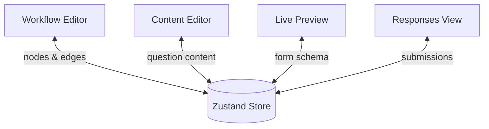

# Form Graph

> A Typeform-style visual form builder powered by a Directed Acyclic Graph (DAG), where every answer determines what question comes next.


## 🔗 Live Demo

https://form-graph.vercel.app/

---

# 📖 Project Story

We've all filled out a form that wouldn't stop asking the wrong questions—you say you don't own a car, and three screens later it's asking about your car insurance anyway.

Form Graph solves that problem.

Instead of following a fixed sequence, it shows **one question at a time** and determines the next question based on your previous answer.

Under the hood, the form is represented as a **Directed Acyclic Graph (DAG)** rather than a linear list. Questions become nodes, transitions become conditional edges, and the next question is computed dynamically from the user's response instead of being hardcoded.

---

# ✨ Core Features

- 🎨 **Visual Workflow Editor** — Build forms using a node-based graph.
- 👁️ **Live Preview** — Answer one question per screen with smooth transitions.
- 🌳 **Smart Branching Logic** — Dynamically choose the next question based on answers.
- 📋 **Response Collection** — Store and review submitted responses.

---

# 🏗️ Architecture

The application revolves around a single source of truth stored in a Zustand store. Every major view reads from and writes to the same form schema.



---

# 🚀 MVP Features

- ✅ Build forms
  - Add, edit and delete questions

- ✅ Branching Logic
  - Conditional navigation between questions
  - Cycle detection (prevents infinite loops)

- ✅ Live Preview
  - One question per screen
  - Smooth navigation
  - Mobile responsive

- ✅ Content Editor
  - Edit question content and branching rules

- ✅ State Persistence
  - Save and load forms

- ✅ Form Responses
  - Submit responses
  - View submitted responses

---

# 🚧 Beyond the MVP

## 🌳 Branching Logic

- Multiple comparison operators
- Branches can merge
- Safe expression evaluator (no `eval()`)

## ✏️ Content Editor

- Rich text editor
- Drag & drop question ordering
- Option management
- Required toggle
- Validation rule editor

## 💾 State & Persistence

- Undo / Redo
- Local Storage backup
- Export / Import JSON

## 📊 Responses

- Save the path each respondent followed
- Response list
- CSV export
- Basic analytics

---

# 🛠️ Tech Stack & Why

| Technology          | Why I Chose It                                                    | Problem It Solves                                                                                                          |
| ------------------- | ----------------------------------------------------------------- | -------------------------------------------------------------------------------------------------------------------------- |
| **Next.js**         | Full-stack framework with frontend and backend in one repository. | Provides routing, API routes, and deployment without maintaining a separate backend.                                       |
| **React Flow**      | Built specifically for node-based editors.                        | Eliminates weeks of work implementing dragging, edges, zooming, minimap, and connection handles.                           |
| **Zustand**         | Lightweight global state management with selectors.               | Shares one form schema across Workflow, Content, Preview, and Responses without prop drilling while minimizing re-renders. |
| **Immer**           | Simplifies immutable updates.                                     | Makes deeply nested state updates concise and enables efficient undo/redo through structural sharing.                      |
| **Zod**             | Runtime validation with TypeScript inference.                     | Validates external data at runtime and keeps TypeScript types synchronized with schemas.                                   |
| **React Hook Form** | High-performance form management.                                 | Uses uncontrolled inputs to minimize re-renders and integrates seamlessly with Zod.                                        |


---

# 🏛️ Architecture Decision Records (ADRs)

The most important architectural decisions are documented as ADRs.

| ADR                                                   | Decision                                  | Summary                                                                                                                                                                                                               |
| ----------------------------------------------------- | ----------------------------------------- | --------------------------------------------------------------------------------------------------------------------------------------------------------------------------------------------------------------------- |
| [ADR-001](./docs/adr/001-dag-vs-linked-list.md)       | DAG over Linked List                      | A Directed Acyclic Graph supports branching, merging, and multiple execution paths, making it ideal for conditional form logic. A linked list only represents a linear sequence of questions.                         |
| [ADR-002](./docs/adr/002-custom-evaluator-vs-eval.md) | Custom Expression Evaluator over `eval()` | `eval()` can execute arbitrary JavaScript and introduces serious security risks. A custom evaluator safely parses and evaluates only whitelisted operators, making execution predictable and secure.                  |
| [ADR-003](./docs/adr/003-zustand-vs-redux.md)         | Zustand over Redux                        | Zustand provides a much simpler API with minimal boilerplate while still offering selector-based subscriptions. For this project's scope, it delivers the required performance without Redux's additional complexity. |

---

# ⚙️ Setup

## Prerequisites

- Node.js 20+
- npm
- Git

## Clone

```bash
git clone https://github.com/fatemeh-khoshkam/form-graph.git

cd form-graph
```

## Install

```bash
npm install
```

## Run

```bash
npm run dev
```

Open:

```
http://localhost:3000
```

---

# 📄 License

This project is licensed under the **MIT License**.
